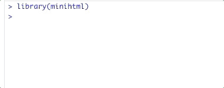
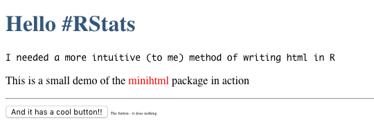

<!-- README.md is generated from README.Rmd. Please edit that file -->

```{r, include = FALSE}
knitr::opts_chunk$set(
  collapse = FALSE,
  comment = "  ",
  fig.path = "man/figures/README-",
  out.width = "100%"
)


library(minihtml)
```


```{r echo = FALSE, eval = FALSE}
# Quick logo generation. Borrowed heavily from Nick Tierney's Syn logo process
library(magick)
library(showtext)
font_add_google("Abril Fatface", "gf")


# pkgdown::build_site(override = list(destination = "../coolbutuseless.github.io/package/minihtml"))
```


```{r echo = FALSE, eval = FALSE}
img <- image_read("man/figures/mini-cooper-s.gif") %>%
  image_transparent(color = "#f9fafb", fuzz = 10) %>%
  image_trim() %>%
  image_threshold()


hexSticker::sticker(subplot  = img,
                    s_x      = 0.92,
                    s_y      = 1.2,
                    s_width  = 1.5,
                    s_height = 0.95,
                    package  = "html",
                    p_x      = 1,
                    p_y      = 0.5,
                    p_color  = "#223344",
                    p_family = "gf",
                    p_size   = 11,
                    h_size   = 1.2,
                    h_fill   = "#ffffff",
                    h_color  = "#223344",
                    filename = "man/figures/logo.png")

image_read("man/figures/logo.png")
```


# minihtml   

<!-- badges: start -->


[](https://travis-ci.org/coolbutuseless/minihtml)
<!-- badges: end -->

`minihtml` is a package for building html documents in R.

`minihtml` objects are compatible with [shiny](https://cran.r-project.org/package=shiny) - see the 
[vignette](https://coolbutuseless.github.io/package/minihtml/articles/shiny.html)


## Overview

| Need to build | R6 object            | alternate initialisation |
|---------------|----------------------|--------------------------|
| HTML elements |                      | `htag`                   |
| HTML elements | `HTMLElement$new()`  | `html_elem()`            |
| HTML document | `HTMLDocument$new()` | `html_doc()`             |


## Quick Examples

| HTML Entity   | code                                                           | result                                        |
|---------------|----------------------------------------------------------------|-----------------------------------------------|
| HTML elements | `htag$a(href = 'http://example.com', "click here")`            | `<a href="http://example.com">click here</a>` |
| HTML elements | `HTMLElement$new('p', "Hello there")`                          | `<p>Hello there</p>`                          |
| HTML elements | `html_elem('p', 'Hello there')$update(style = 'display:none')` | `<p style="display:none">Hello there</p>`     |
| HTML document | `html <- HTMLDocument$new(); html$add('p', 'hello')`           | `<html> <p>hello</p> </html>`                 |
| HTML document | `html_doc(htag$h1("Big"), htag$p("Hello"))`                    | `<html> <h1>Big</h1> <p>Hello</p> </html>`    |

## Installation

You can install `minihtml` from [GitHub](https://github.com/coolbutuseless/minihtml) with:

``` r
# install.packages("devtools")
devtools::install_github("coolbutuseless/minihtml")
```


## `htag` helper (autocomplete HTML tags and attributes)

The `htag` helper is similar to `shiny::tag` but offers autocomplete to assist 
in writing the code:




## Interface

* Individual elements can be created in a number of ways. E.g. creating a div
    * As a stand-alone element
        * `new_div <- HTMLElement$new('div', class = 'demo')`
        * `new_div <- html_elem('div', class = 'demo')`
        * `new_div <- htag$div(class = 'demo')`
    * As a sub-element of an existing document or element - the element is created,
      added to the parent document (or element) and returned.
        * `doc <- HTMLDocument$new(); new_div <- doc$add('div', class = 'demo')`
        * `doc <- HTMLDocument$new(); new_div <- doc$div(class = 'demo')`
        * `elem <- HTMLElement$new('xxx'); new_div <- elem$add('div', class = 'demo')`
        * `elem <- HTMLElement$new('xxx'); new_div <- elem$div(class = 'demo')`
* `$add()` creates an element and adds it to the parent (and returns it)
    * `new_div <- doc$add('div')`
* `$append()` appends the given elements as children
    * `new_div <- htag$div(); doc$append(new_div, ...)`
* `$new(name, ...)`, `$update(...)` and `$add(name, ...)` all accept `...` where
    * **named arguments** are added as *attributes* of this node
    * **unnamed argument** are added as *children* of this node


## Parsing HTML text into a `minihtml` document

`minihtml` uses `xml2` to parse HTML text (or file) into a `minihtml` document.

```{r}
my_html <- "<p>Par contents</p>"
elem <- minihtml::parse_html_elem(my_html)
elem$update(width = "100px")$
  add(name = 'span', 'inner contents')

cat(as.character(elem))
```


## All-in-one example

```{r}
#~~~~~~~~~~~~~~~~~~~~~~~~~~~~~~~~~~~~~~~~~~~~~~~~~~~~~~~~~~~~~~~~~~~~~~~~~~~~~~
# Initialse an HTML document
#~~~~~~~~~~~~~~~~~~~~~~~~~~~~~~~~~~~~~~~~~~~~~~~~~~~~~~~~~~~~~~~~~~~~~~~~~~~~~~
my_div <- htag$div()  #  or use `html_elem('div')`

#~~~~~~~~~~~~~~~~~~~~~~~~~~~~~~~~~~~~~~~~~~~~~~~~~~~~~~~~~~~~~~~~~~~~~~~~~~~~~~
# Add a header and body to the html (and then keep the reference these)
#~~~~~~~~~~~~~~~~~~~~~~~~~~~~~~~~~~~~~~~~~~~~~~~~~~~~~~~~~~~~~~~~~~~~~~~~~~~~~~
top    <- my_div$div()
bottom <- my_div$div()

#~~~~~~~~~~~~~~~~~~~~~~~~~~~~~~~~~~~~~~~~~~~~~~~~~~~~~~~~~~~~~~~~~~~~~~~~~~~~~~
# Add a title to the header, and an H1 to the body
#~~~~~~~~~~~~~~~~~~~~~~~~~~~~~~~~~~~~~~~~~~~~~~~~~~~~~~~~~~~~~~~~~~~~~~~~~~~~~~
top$h1("Hello RStats")$update(style = "color: #345678")

#~~~~~~~~~~~~~~~~~~~~~~~~~~~~~~~~~~~~~~~~~~~~~~~~~~~~~~~~~~~~~~~~~~~~~~~~~~~~~~
# Create a 'div' directly within the body, and a 'p' within that 'div'
#~~~~~~~~~~~~~~~~~~~~~~~~~~~~~~~~~~~~~~~~~~~~~~~~~~~~~~~~~~~~~~~~~~~~~~~~~~~~~~
bottom$
  update(class="main")$
  p("I needed a more intuitive (to me) method of writing html in R", style = 'font-family: monospace')

#~~~~~~~~~~~~~~~~~~~~~~~~~~~~~~~~~~~~~~~~~~~~~~~~~~~~~~~~~~~~~~~~~~~~~~~~~~~~~~
# independently create another div
#~~~~~~~~~~~~~~~~~~~~~~~~~~~~~~~~~~~~~~~~~~~~~~~~~~~~~~~~~~~~~~~~~~~~~~~~~~~~~~
div2 <- htag$div(
  htag$p(
    "This is a small demo of the ",
    htag$span("minihtml", style = 'color: red'),
    "package in action"),
  htag$hr(),
  htag$div(
    htag$button("And it has a cool button!!"),
    htag$span("The button - it does nothing", style = 'font-size: 6px')
  )
)

#~~~~~~~~~~~~~~~~~~~~~~~~~~~~~~~~~~~~~~~~~~~~~~~~~~~~~~~~~~~~~~~~~~~~~~~~~~~~~~
# Manually append this div to the body
#~~~~~~~~~~~~~~~~~~~~~~~~~~~~~~~~~~~~~~~~~~~~~~~~~~~~~~~~~~~~~~~~~~~~~~~~~~~~~~
bottom$append(div2)
```


```{r eval = FALSE}
#~~~~~~~~~~~~~~~~~~~~~~~~~~~~~~~~~~~~~~~~~~~~~~~~~~~~~~~~~~~~~~~~~~~~~~~~~~~~~~
# Because github README's don't allow inline styles, the following is a
# screenshot of the rendered HTML
#~~~~~~~~~~~~~~~~~~~~~~~~~~~~~~~~~~~~~~~~~~~~~~~~~~~~~~~~~~~~~~~~~~~~~~~~~~~~~~
my_div
```


<!-- Raw HTML output. hidden by default -->
<details closed>
<summary> <span title='Raw HTML'> Raw HTML </span> </summary>
```{r echo = FALSE}
print(my_div)
```
</details><br />


<!-- Github doesn't like inline HTML styling. So insert a screenshot -->



